# zarr-view
PySide or PyQt tree model-view for a Zarr hierarchy

- [Install](#install)
- [Quick start example](#quick-start-example)
- [Path slice](#path-slice)
- [Path slice for N-D arrays of nested ordered groups](#path-slice-for-n-d-arrays-of-nested-ordered-groups)

# Install
1. Install either `"PySide6>=6.5.2"`, `"PyQt6>=6.5.2"`, or `PyQt5`. :warning: The Qt6 version requirements are due to a [Qt6.5.1 bug](https://bugreports.qt.io/browse/QTBUG-115136) that causes the tree view to crash on macOS arm64 chipset. If you are using a different OS, then this bug may not apply to you and you may be able to ignore these version requirements. For example:
```
pip install "PySide6>=6.5.2"
```
2. Install `zarrview`:
```
pip install zarrview
```

# Quick start example
The following code is from [/examples/quick_start_example.py](/examples/quick_start_example.py):
```python
# Replace PySide6 with PyQt6 or PyQt5 depending on what Qt package you installed.
from PySide6.QtWidgets import QApplication
import sys
import zarr
from zarrview.ZarrViewer import ZarrViewer

# example zarr hierarchy (in-memory vs on-disk should not matter)
root = zarr.group()
foo = root.create_group('foo')
bar = foo.create_dataset('bar', shape=100, chunks=10)
baz = foo.create_group('baz')
quux = baz.create_dataset('quux', shape=200, chunks=20)

# attributes for quux
quux.attrs['a_int'] = 82
quux.attrs['a_float'] = 3.14
quux.attrs['a_bool'] = False
quux.attrs['a_str'] = 'zarr-view is awesome!'
quux.attrs['a_dict'] = {'a_child': 42}
quux.attrs['a_list'] = [8, 4.5, True, 'hello']

# create app
app = QApplication(sys.argv)

# init zarr viewer widget with root of hierarchy
viewer = ZarrViewer(root)

# Here the viewer is shown in its own window.
# However, it can also be inserted int a Qt app just like any QWidget.
viewer.show()
viewer.setWindowTitle('ZarrViewer')

# run app
sys.exit(app.exec())
```

The viewer displays a tree view of the Zaar hierarchy groups and arrays along with a representation of each arrays size and data type.

Selecting a group or array in the tree view of the Zarr hierarchy displays the info for the selected object below the tree:

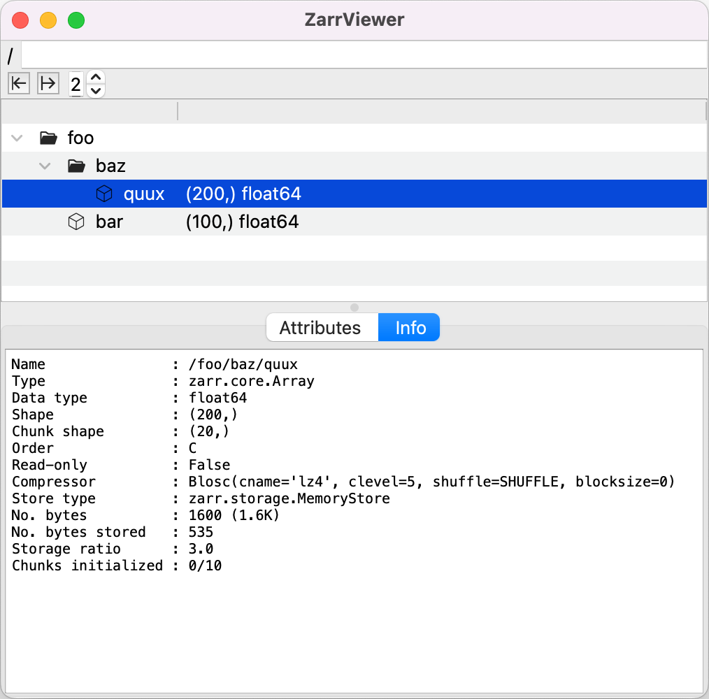

The selected object's attributes can also be viewed and edited in their own tree view below the main hierarchy view:

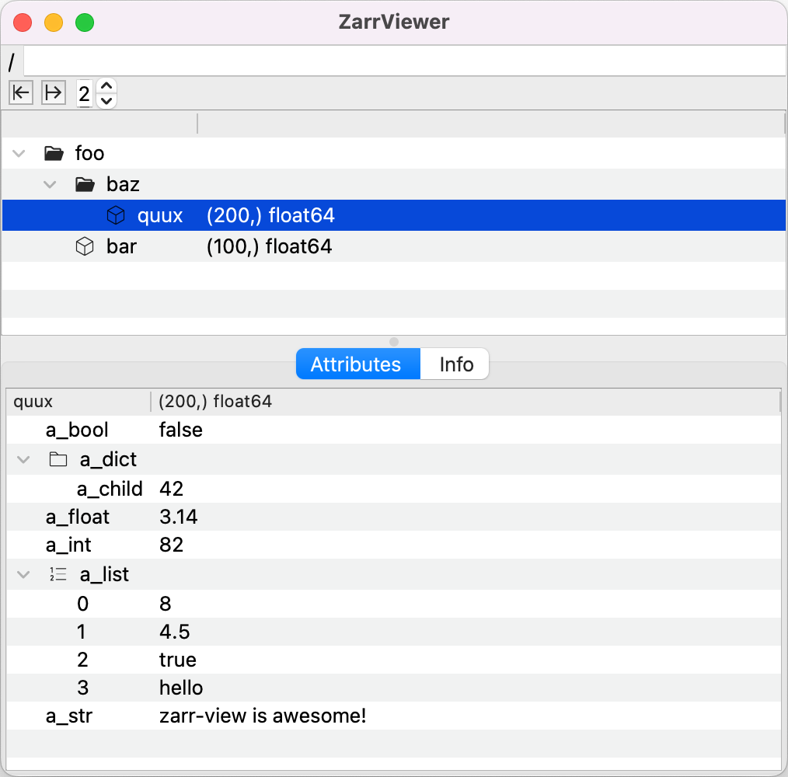

You can insert new attributes or delete attributes via the viewer:

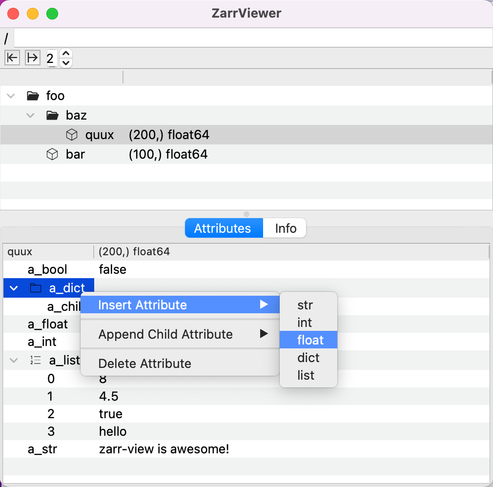

Toolbar buttons allow quickly collapsing or expanding the tree to any level:

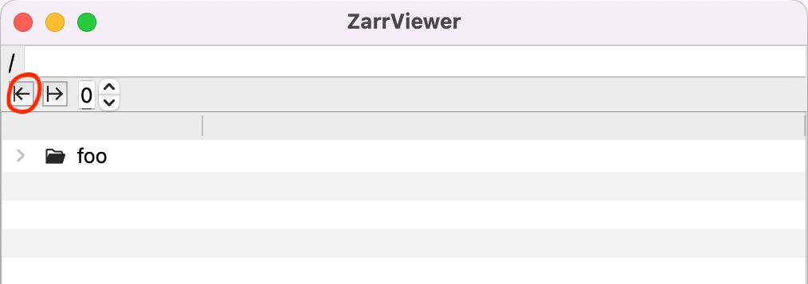

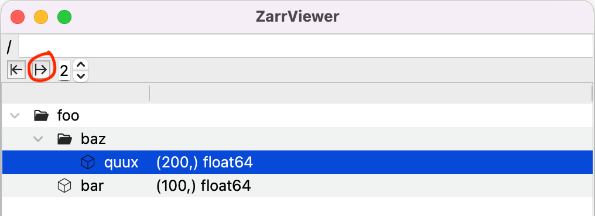

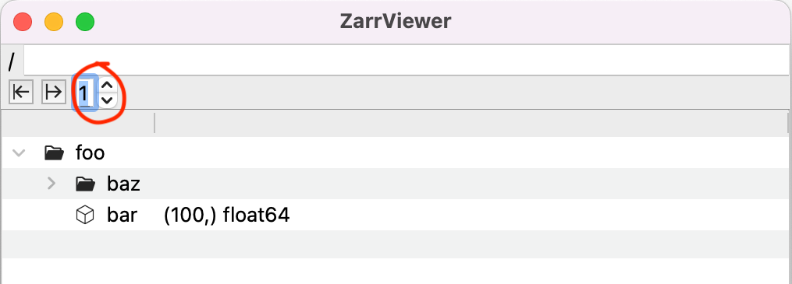

You can insert new groups or delete groups or arrays via the viewer:

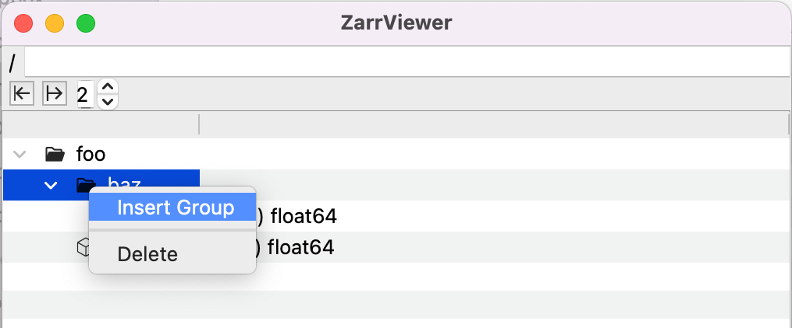

You can rename all groups, arrays, and attrs:

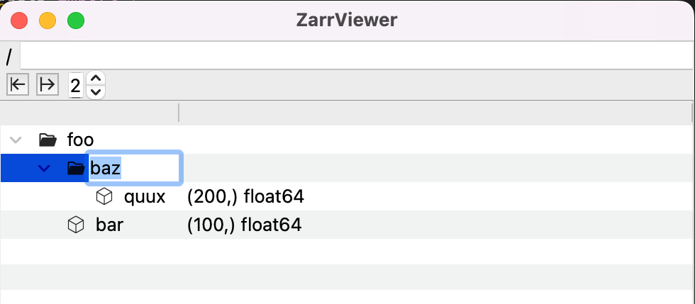

You can drag and drop groups or arrays to restructure the hierarchy:

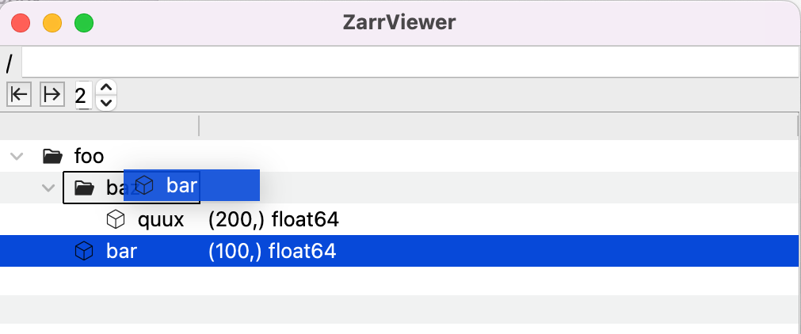

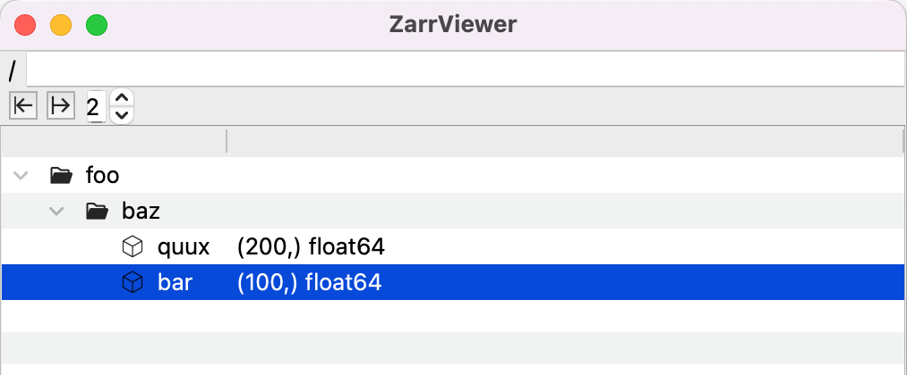

You can specify a specific path or path slice to view only a subset of the hierarchy (see the sections on [path slice](#path-slice) and [path slice for N-D arrays of nested ordered groups](#path-slice-for-n-d-arrays-of-nested-ordered-groups)):

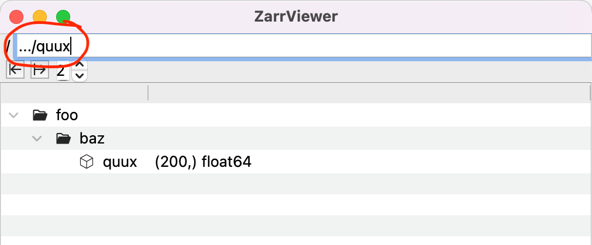

You can dynamically reset the displayed hierarchy:
```python
viewer.setTree(new_root)
```

# Path slice
It can be useful to view only a subset of a large hierarchy. This can be done in the `ZarrViewer` widget by specifying a path or path slice to view. 

All functions for Zarr hierarchy path slices are in `zarr_path_utils.py` which is independent of the Qt model-view classes in `ZarrViewer.py`. Thus, these path utilities may be useful outside of the Qt tree model-view interface. The paths in a slice are found by regex matching paths in the hierarchy.

Consider the following Zarr hierarchy where branches are groups and leaves are either groups or arrays:
```
/
├── foo
│   ├── bar
│   │   ├── baz
│   │   └── quux
│   ├── foo
│   │   ├── bar
│   │   └── baz
│   │       └── quux
│   └── baz
│       ├── quux
│       └── foo
│           └── bar
│               └── baz
│                   └── quux
└── bar
    ├── baz
    └── quux
```

The following are examples of specifying a subset of the above hierarchy using a path slice:

`"foo/bar"`:
```
/
└── foo
    └── bar
```

`"*/baz"`:
```
/
├── foo
│   └── baz
└── bar
    └── baz
```

`"foo/*/baz"`:
```
/
└── foo
    ├── bar
    │   └── baz
    └── foo
        └── baz
```

`"foo/.../baz"`:
```
/
└── foo
    ├── bar
    │   └── baz
    ├── foo
    │   └── baz
    └── baz
        └── foo
            └── bar
                └── baz
```

`".../bar"`:
```
/
├── foo
│   ├── bar
│   ├── foo
│   │   └── bar
│   └── baz
│       └── foo
│           └── bar
└── bar
```

`".../foo/bar/..."`:
```
/
└── foo
    ├── bar
    │   ├── baz
    │   └── quux
    ├── foo
    │   └── bar
    └── baz
        └── foo
            └── bar
                └── baz
                    └── quux
```

`".../baz/quux"`:
```
/
└── foo
    ├── foo
    │   └── baz
    │       └── quux
    └── baz
        └── foo
            └── bar
                └── baz
                    └── quux
```

Note that the path slice functions actually return only the Zarr objects at the matched paths:
```
".../baz/quux" -> ["foo/foo/baz/quux", "foo/baz/foo/bar/baz/quux"]
```
However, the subtree containing the matched paths as indicated above is easily reconstructed in the viewer.

# Path slice for N-D arrays of nested ordered groups
Consider an example dataset for EEG recordings across 100 trials and 64 probes where each recorded waveform is a time series with 2000 samples. Furthermore, the dataset includes the (x,y,z) location of each probe and the reward probability on each trial. This dataset could be stored as a 3-D array for the EEG waveforms across trials and probes, a 2-D array for the probe (x,y,z) locations, and a 1-D array for the trial reward probabilities:
```
/
    eeg_waveforms (100, 64, 2000) float
    probe_locations (64, 3) float
    trial_reward_probas (100,) float
```
where sample frequency and units are left to metadata.

Alternatively, the dataset could be stored as a nested hierarchy of groups for each trial and probe with leaf 1-D arrays for each individual EEG waveform:
```
/
    trial.i/
        probe.j/
            eeg_waveform (2000,) float
```
where `i` is in 0-99 and `j` is in 0-63 such that the ordering of the trials and probes is contained in the group paths (e.g., `trial.3/probe.42/`). The probe location and trial reward probability are simply stored as attributes of their respective groups.

Why might you want to store your data in such a tree hierarchy rather than a series of N-D arrays?
- **Associated data:** It is trivial to append entire trees of associated data to individual trials or probes within a trial. In contrast, for the 3-D array example you would need to store additional indices along with any associated data to indicate which trials/probes the data belonged with. Although such indices are trivial to provide, they complicate deciphering and maintaining the dataset, and require some metadata conventions to be universally understood. In contrast, the relationships in the tree format are obvious even to a naive program that does not understand the concept of a trial or a probe. For example, consider adding a note to a specific trial indicating that the subject was distracted by something during that trial.
- **Restructure or copy a subset of the data:** It is trivial to simply move, delete, or copy entire subtrees including both primary and the relevant associated data. In contrast, for the 3-D array example you would need to ensure that all associated data arrays were similarly manipulated to reflect the changed or copied subset of the primary data array, which is difficult to automate without strict universal conventions. Note that [Xarray](https://xarray.dev) conventions may suffice for cases where labeled dimensions are sufficient to find matching slices in all arrays in the dataset.
- **Flexibility:** The tree format is more flexible than the array format in that arbitrary associated data can be added at any level and that it is straightforward to represent ragged arrays in the tree.

:bangbang: **If you do decide to go the route of the tree format, one thing you certainly don't want to give up is the ability to slice your dataset as is trivially done for the 3-D array** (e.g., `eeg_waveforms[82,20:22]`).

`zarr_path_utils.py` provides functions for similarly slicing a path hierarchy of nested ordered groups such as `trial.i/probe.j/` using [NumPy](https://numpy.org) slice syntax. The following are examples of such path slices for the EEG dataset above.

`"trial[82]/probe[20:22]/..."`:
```
/
    trial.82/
        probe.20/
            eeg_waveform (2000,) float
        probe.21/
            eeg_waveform (2000,) float
```

From [/examples/eeg_example.py](/examples/eeg_example.py):

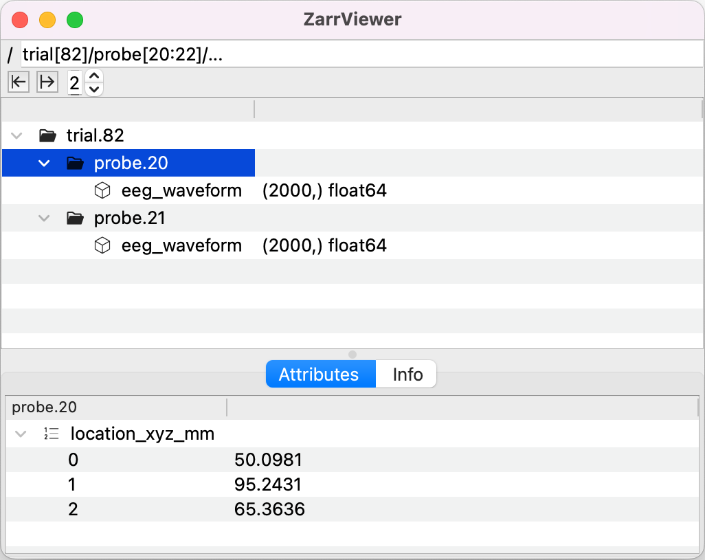

`"trial[:2]/probe[62:]/..."`:
```
/
    trial.0/
        probe.62/
            eeg_waveform (2000,) float
        probe.63/
            eeg_waveform (2000,) float
    trial.1/
        probe.62/
            eeg_waveform (2000,) float
        probe.63/
            eeg_waveform (2000,) float
```

`"trial[9]/probe[[1,5]]/..."`:
```
/
    trial.9/
        probe.1/
            eeg_waveform (2000,) float
        probe.5/
            eeg_waveform (2000,) float
```

`"trial[80:90:2]"`:
```
/
    trial.80/
    trial.82/
    trial.84/
    trial.86/
    trial.88/
```
